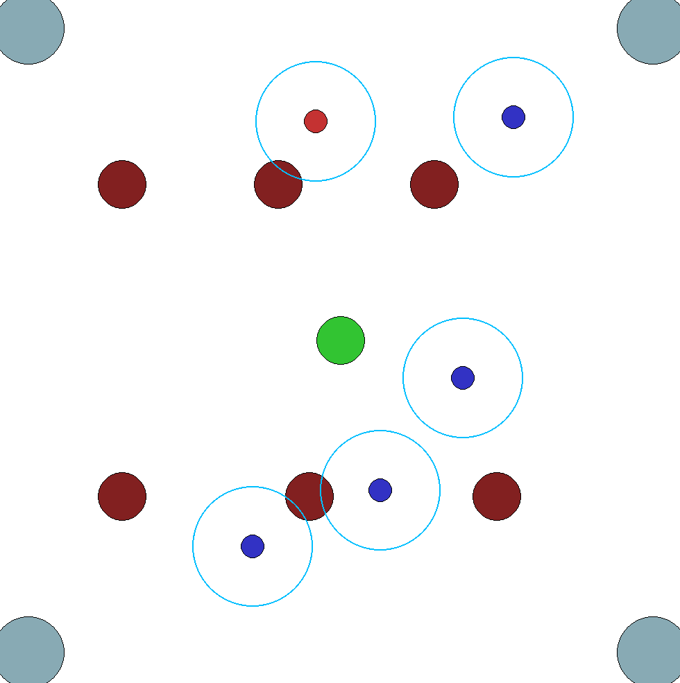

# Patrolling: Multi-Agent Reinforcement Learning (TorchRL)

## Description
This project explores a multi-agent system where autonomous drones, acting as patrollers and intruders, engage in a strategic pursuit. The patroller drones aim to detect and neutralize intruder drones, while the intruders attempt to reach a specific target point undetected. The primary focus of the project is to investigate how indirect communication among patroller drones can enhance their collective ability to locate and intercept the intruders. By simulating realistic interactions and decision-making processes, this project provides insights into the dynamics of teamwork, strategy, and communication in multi-agent environments.

## Visuals

## Installation
1. git clone git@gitlab.inf.elte.hu:student-projects-and-thesis/collective-intelligence/patrolling.git
2. cd patrolling
3. pip install -r requirements.txt

## Usage
Run: python3 main.py
As of now everything is hardcoded, the patroller and intruder amount can be adjusted, but the landmarks are fixed, cannot be changed.
The evaluate function has two modes: human and rgb_array. 
The human mode makes it so a pygame window opens and the simulation can be seen live. 
The rgb_array mode makes it so that the games are saved into the gifs folder, as seen in the game_17.gif example

## Roadmap
Planned improvements in order:
1. **Energy Usage**: Implement realistic energy consumption models for drones.
2. **Dynamic Maps**: Add more challenging and possibly dynamic map layouts.
3. **Real-World Units**: Introduce speed, time, and size based on real-world drone data.
4. **Additional Sensors**: Equip agents with simulated sensors to enhance capabilities.

## Authors and acknowledgment
Author: Tóth Kristóf
Project Consultant: Kovács Szilárd 